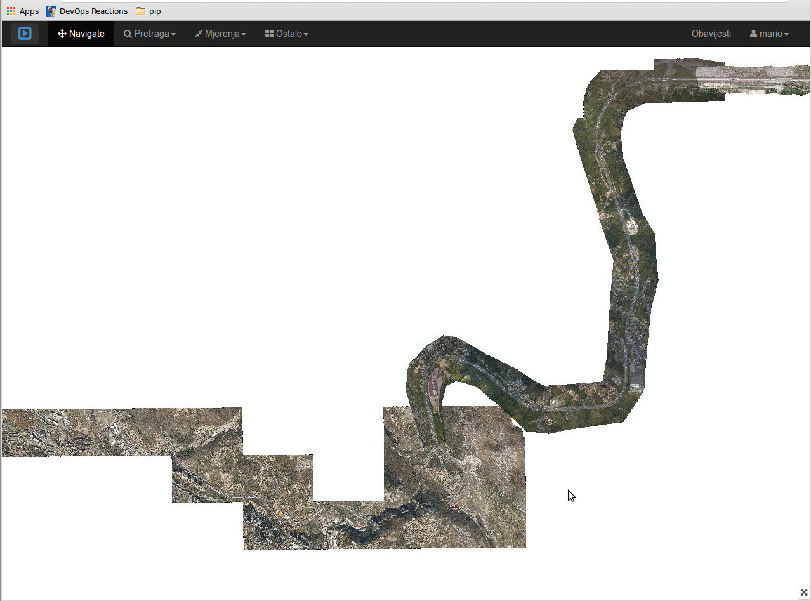
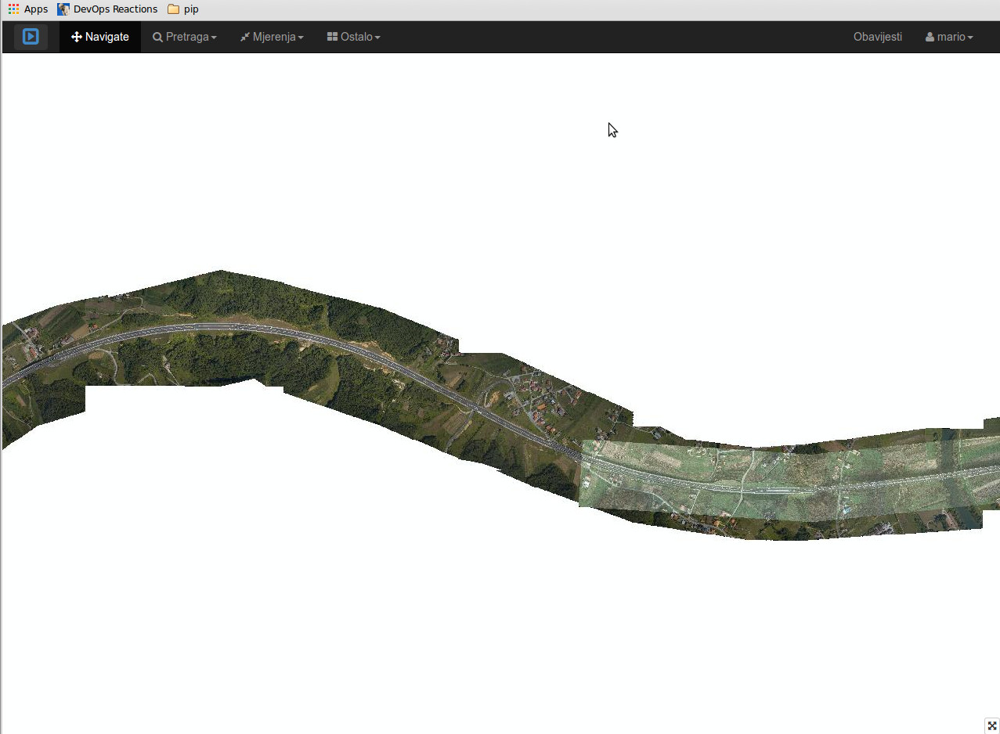

#Tile2Symlnk
-----
This script finds all single-color tiles in GWC (GeoWebCache) layer folder and creates symbolic links. 


In almost all web mapping applications we use some kind of mapping server, Geoserver, MapServer etc. In order to speed up delivery of maps (map tiles) we use caching applications like GeoWebCache (GWC). GWC caches a lot of images (tiles) on server and stores them directly on the disk. In some special cases, for example when there is high percentage of NODATA values in raster images, GWC creates a lot of single-color tiles which are duplicated on the disk. Those images can unnecessary occupy a lot of disk space. To solve this problem, we can create an symbolic link to one single-color image.
This script does exactly that. It detects single-color image in particular GWC layer folder and links it to only one image which is stored somewhere else on the disk.

Please look at the **config.cfg** file for more explanation and modify it based on your configuration. **Do not run this script before reading this file and modifying it !**

**NOTICE:** script has to be run with superuser rights (sudo) because of changing the rights for newly created single-color files and accessing GWC folders. I know it is a dumb way to do it, but I am open to an ideas how to do it better. :) And no, this script will not delete your root folder :)

## Usage
Run script like:
```
sudo python tile2symlnk.py
```
## Requirements
1. tested only on Python 2.7
2. PIL or Pillow

**NOTICE:** script works only on Linux OS (maybe Mac OS, didn't test it) because of symbolic linking.

Running this script more than once on the same folder, will not take into account for existing symbolic links.

Of course, if you reseed your GWC layer, you will have to run this script again for that GWC layer because reseeding deletes existing symbolic links.

Example of situation where there is a lot of NODATA value in raster images. This is an example of aerial raster images only on area around highway (500m). You can imagine number of single-color tiles if you cache all those tiles from 0 to 20 zoom level.


